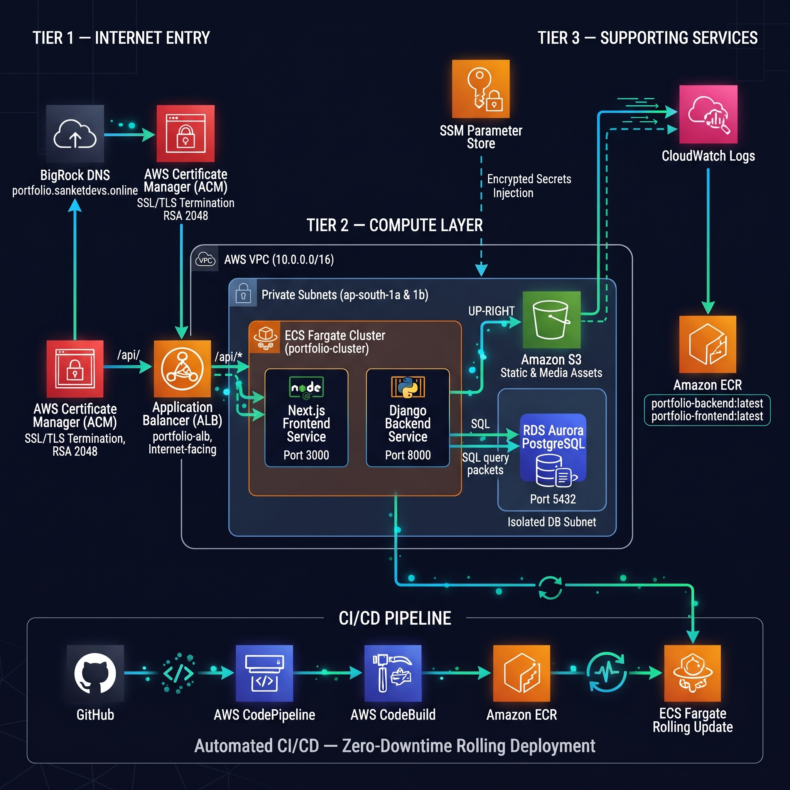

# Control Plane — Next-Gen AWS DevOps Portfolio Platform

[](https://aws.amazon.com/)
[](https://www.docker.com/)
[](https://nextjs.org/)
[](https://www.djangoproject.com/)
[](https://aws.amazon.com/rds/)
[](https://portfolio.sanketdevs.online)

> An enterprise-grade, high-availability monitoring and control dashboard portfolio platform deployed on **AWS ECS Fargate** with a fully automated **AWS CodePipeline CI/CD** rolling deployment strategy, custom domain SSL via **AWS Certificate Manager (ACM)**, and secure externalized secrets management via **SSM Parameter Store**.

---

## 🏗️ System Architecture



---

## 🛠️ Technology Stack

| Layer | Technology | Purpose |
|-------|-----------|---------|
| **Frontend** | Next.js 14 (Standalone) | Server-rendered React application with App Router |
| **Backend** | Django REST Framework 4.2 | RESTful API server with JWT authentication |
| **WSGI Server** | Gunicorn | Production-grade Python WSGI HTTP server |
| **Database** | AWS RDS Aurora Serverless v2 (PostgreSQL) | Managed, scalable relational database |
| **Static Storage** | Amazon S3 | Static files & media asset storage |
| **Container Registry** | Amazon ECR | Private Docker image repository |
| **Orchestration** | AWS ECS Fargate | Serverless container orchestration |
| **Load Balancer** | AWS ALB | Path-based routing with HTTPS termination |
| **SSL/TLS** | AWS Certificate Manager (ACM) | Managed SSL certificate for `portfolio.sanketdevs.online` |
| **DNS** | BigRock (External Registrar) | Domain management with CNAME validation for ACM |
| **Secrets** | AWS SSM Parameter Store | Encrypted credential injection at container boot |
| **Logging** | AWS CloudWatch Logs | Centralized container log aggregation |
| **CI/CD** | AWS CodePipeline + CodeBuild | Automated build, test, and deploy pipeline |

---

## ⚙️ Infrastructure Deep Dive

### 1. Networking & VPC Architecture
The application runs inside a custom **AWS VPC (10.0.0.0/16)** spanning **2 Availability Zones** (`ap-south-1a` and `ap-south-1b`) for fault tolerance:
- **2 Public Subnets**: Host the internet-facing Application Load Balancer.
- **2 Private Subnets**: Host the ECS Fargate container tasks (no direct internet exposure).
- **Isolated DB Subnets**: Host the RDS Aurora PostgreSQL instance, accessible only from the backend security group.

### 2. Security Groups (Least-Privilege Firewall Rules)
| Security Group | Ingress Rule | Source |
|----------------|-------------|--------|
| `ALB-SG` | Port 80 (HTTP), Port 443 (HTTPS) | `0.0.0.0/0` (Internet) |
| `Frontend-SG` | Port 3000 | `ALB-SG` only |
| `Backend-SG` | Port 8000 | `ALB-SG` only |
| `DB-SG` | Port 5432 | `Backend-SG` only |

### 3. SSL/TLS & Custom Domain
The domain **`portfolio.sanketdevs.online`** is registered on **BigRock** (external DNS registrar). SSL is managed using **AWS Certificate Manager (ACM)**:
- An ACM public certificate was requested for `portfolio.sanketdevs.online`.
- DNS validation was completed by adding the ACM-provided **CNAME records** in the BigRock DNS management panel.
- The issued certificate is attached to the ALB **HTTPS:443** listener, enabling end-to-end encrypted traffic.

#### 📸 ACM Certificate — Issued & Active
.png)

### 4. Application Load Balancer (ALB) — Path-Based Routing
The ALB dynamically routes incoming requests based on URL paths:
- **`/`** → Forwarded to `portfolio-tg-fe-blue-ip` (Next.js Frontend on Port 3000)
- **`/api/*`** → Forwarded to `portfolio-tg-be-blue-ip` (Django Backend on Port 8000)
- **HTTP:80** → Automatically redirects to **HTTPS:443** (HTTP 301)

#### 📸 Application Load Balancer — Active with HTTPS Listener
.png)

---

## 🔒 Secrets Management

All sensitive environment variables are externalized from source code and securely stored in **AWS Systems Manager (SSM) Parameter Store**. ECS task definitions reference these parameters at container launch:

| Parameter Path | Type | Purpose |
|----------------|------|---------|
| `/portfolio/DB_HOST` | String | RDS Aurora endpoint hostname |
| `/portfolio/DB_NAME` | String | PostgreSQL database name |
| `/portfolio/DB_USER` | String | Database username |
| `/portfolio/DB_PASSWORD` | SecureString | Database password (KMS encrypted) |
| `/portfolio/SECRET_KEY` | SecureString | Django cryptographic signing key |
| `/portfolio/GITHUB_TOKEN` | SecureString | GitHub API token for repo sync |
| `/portfolio/AWS_STORAGE_BUCKET_NAME` | String | S3 bucket name for assets |

#### 📸 SSM Parameter Store — Encrypted Secrets
.png)

---

## 🐳 Containerization & ECR

Both the frontend and backend are packaged as optimized, multi-stage Docker images:

| Image | Base | Size Optimization | Port |
|-------|------|-------------------|------|
| `portfolio-frontend` | `node:20-alpine` | Next.js standalone output mode | 3000 |
| `portfolio-backend` | `python:3.11-slim` | Multi-stage pip install + slim runtime | 8000 |

Images are pushed to **Amazon Elastic Container Registry (ECR)** with both `latest` and git commit hash tags for versioning and rollback traceability.

#### 📸 Amazon ECR — Private Repositories
.png)

---

## 🚀 ECS Fargate Cluster — Serverless Containers

The application runs on **AWS ECS Fargate** (serverless compute), eliminating the need to manage EC2 instances:
- **Cluster**: `portfolio-cluster` (Active)
- **Services**: 2 Active (`portfolio-frontend-service`, `portfolio-backend-service`)
- **Tasks**: 2 Running, 0 Pending
- **Deployment Strategy**: ECS Rolling Update (Zero-Downtime)
  - `minimumHealthyPercent: 100%` — Old tasks stay alive until new ones pass health checks.
  - `maximumPercent: 200%` — New tasks are provisioned alongside old ones during deployment.

#### 📸 ECS Cluster — 2 Active Services, 2 Running Tasks
.png)

---

## 🔄 CI/CD Pipeline — Fully Automated Delivery

The entire build and deployment lifecycle is automated using a **3-stage AWS CodePipeline**:

```
┌──────────┐     ┌──────────┐     ┌──────────────────────────┐
│  Source   │────▶│  Build   │────▶│        Deploy            │
│  GitHub   │     │ CodeBuild│     │ ┌────────────────────┐   │
│  (main)   │     │          │     │ │ DeployFrontend ✅  │   │
│           │     │ Docker   │     │ │ (Amazon ECS)       │   │
│  Webhook  │     │ Build +  │     │ ├────────────────────┤   │
│  Trigger  │     │ ECR Push │     │ │ Deploy (Backend) ✅│   │
│           │     │          │     │ │ (Amazon ECS)       │   │
└──────────┘     └──────────┘     │ └────────────────────┘   │
                                  └──────────────────────────┘
```

### Pipeline Stages:
1. **Source**: GitHub webhook triggers pipeline on every push to `main` branch.
2. **Build**: AWS CodeBuild authenticates to ECR, builds both Docker images, tags with commit hash, pushes to ECR, and outputs `imagedefinitions.json` artifacts.
3. **Deploy**: Two parallel ECS deploy actions update the frontend and backend services using rolling update strategy.

#### 📸 CodePipeline — All Stages Successful (100% Green)
.png)

#### 📸 CodePipeline — Deploy Stage In Progress
.png)

---

## 🌐 Live Application

The application is live at **[https://portfolio.sanketdevs.online](https://portfolio.sanketdevs.online)**

### Public Dashboard (Terminal-Themed UI)
A DevOps monitoring control dashboard with a terminal boot sequence, system modules panel, and real-time status indicators:

#### 📸 Portfolio Dashboard — Live Production
.png)

### Admin Panel (Content Management System)
A full-featured admin panel for managing portfolio content (projects, skills, certifications, experience, social links, resume, and contact messages):

#### 📸 Admin Panel — System Overview
.png)

---

## 💻 Local Development Setup

### Prerequisites
- Docker & Docker Compose
- Node.js v20+
- Python v3.11+

### Quick Start
```bash
# Clone the repository
git clone https://github.com/MrSanketPrajapatissp/DevOps-Portfolio.git
cd DevOps-Portfolio

# Start backend
cd backend
python -m venv venv
source venv/bin/activate   # Windows: venv\Scripts\activate
pip install -r requirements.txt
python manage.py migrate
python manage.py runserver

# Start frontend (new terminal)
cd ../frontend
npm install
npm run dev
```

Access the application at `http://localhost:3000`. Admin panel at `/admin-portal`.

---

## 📂 Repository Structure

```
DevOps-Portfolio/
├── backend/                    # Django REST Framework API
│   ├── Dockerfile              # Multi-stage Python 3.11-slim build
│   ├── entrypoint.sh           # DB wait → migrate → collectstatic → gunicorn
│   ├── gunicorn.conf.py        # Production WSGI server config
│   ├── portfolio/settings.py   # Dynamic DB/S3/CORS configuration
│   └── requirements.txt        # Python dependencies
├── frontend/                   # Next.js 14 App Router
│   ├── Dockerfile              # Multi-stage Node 20-alpine build
│   ├── next.config.mjs         # Standalone output mode
│   ├── app/                    # Pages and layouts
│   ├── components/             # Reusable UI components
│   └── lib/                    # API client & utilities
├── buildspec.yml               # AWS CodeBuild specification
├── taskdef-backend.json        # ECS Task Definition template (backend)
├── taskdef-frontend.json       # ECS Task Definition template (frontend)
├── appspec-backend.yaml        # CodeDeploy app spec (backend)
├── appspec-frontend.yaml       # CodeDeploy app spec (frontend)
└── docs/screenshots/           # AWS Console proof screenshots
```

---

<p align="center">
  <b>Built with ❤️ by <a href="https://github.com/MrSanketPrajapatissp">Sanket Prajapati</a></b><br>
  <i>AWS DevOps Engineer | Cloud Infrastructure | CI/CD Automation</i>
</p>
